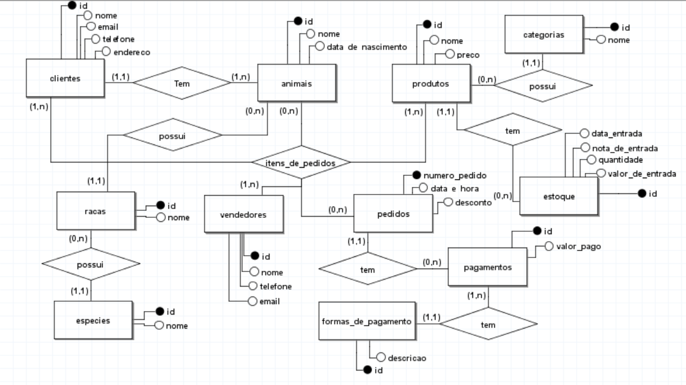
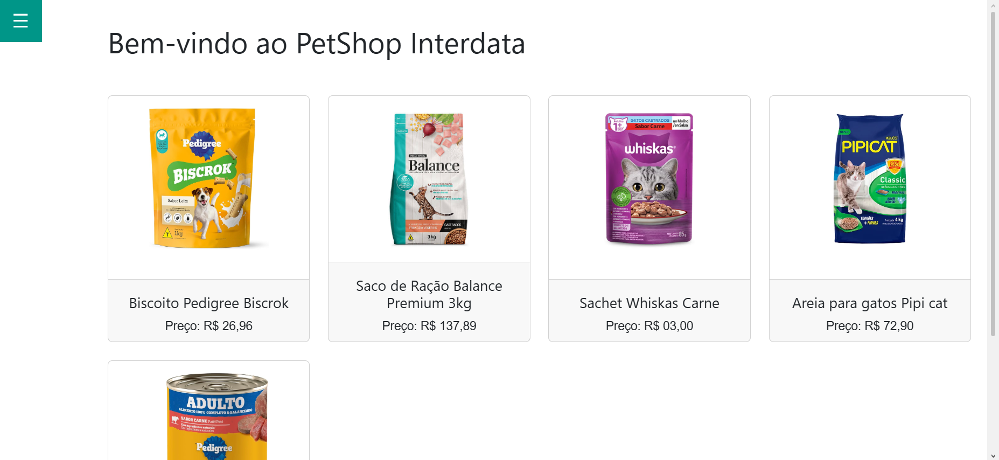
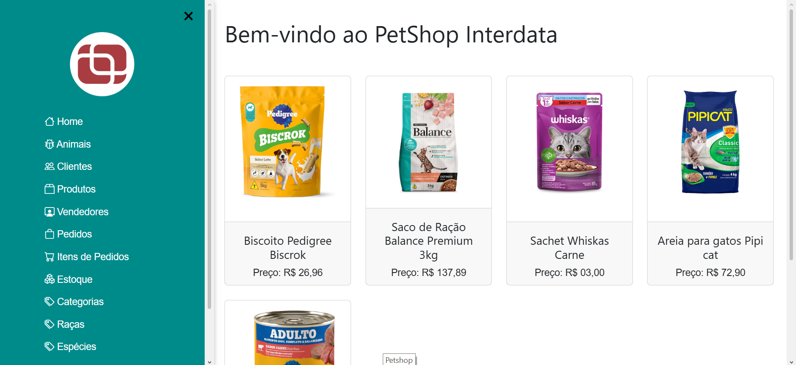
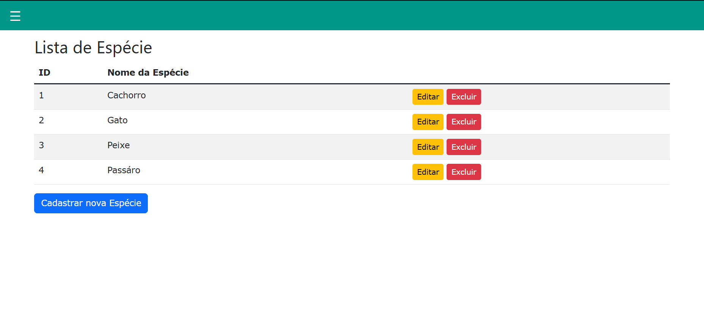
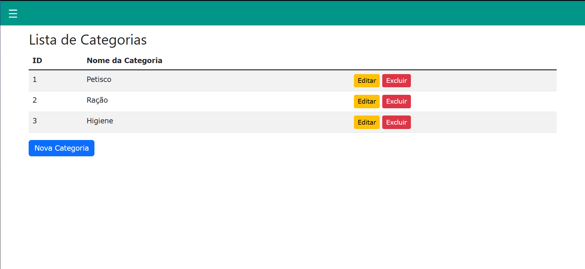
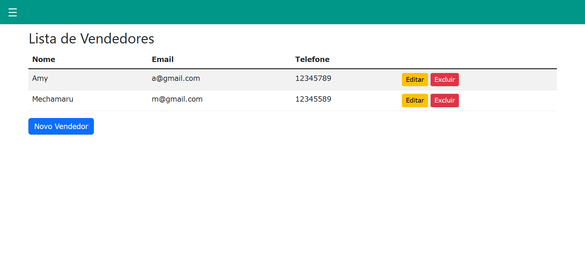

# Petshop
### Sistema de um petshop com integração ao banco de dados e organização MVC. Este foi o meu primeiro sostema utilizando o Springboot; nele é possível cadastrar usuários, pets de cada usuário, a raça e a espécie do pet (utilizando relacionamentos no banco), produtos e fazer pagamento em boletos. (a área de boletos ainda está em andamento). A interface não é tão decorada pois foi um sistema focado mais no back-end do que no front-end.

# Diagrama de Entidade e Relacionamento
Esse é o diagrama do banco de dados utilizado nesse sistema. As tabelas possuem vários relacionamentos complexos entre si.

# Imagens da Interface
Aqui estará as imagens da interface do site, tentando mostrar como funciona cada área.

## Index
A aba inicial do site trabalha juntamente com a parte de produtos. Todos os produtos listados no banco (até com suas imagens sendo pegas pelo path) são colocados nessa parte, formando um grid.

#

## Fragmento Sidebar
Esta side bar é um fragmento (arquivo html a parte) que está presente em todo o site, por ser um arquivo a parte não é necessário atualizar outras sidebars, já que são uma só fragmentada pelo site. 

#

## CRUD e Formas de Pagamento
Utilizei dessa parte em específico para demonstrar o CRUD funcional do banco de dados. Essa aba serve para adicionar uma forma de pagamento específica que pode ser chamada como uma chave estrangeira quando o usuário for pagar. A primeira imagem logo abaixo é antes de qualquer alteração para a demonstração do CRUD.

### Cadastrar (Create)
Aqui está sendo criado a forma com id 5 (cheque)

### Ler (Read)
Após a criação é mostrado a nova forma de pagamento no final da tabela

### Editar (Update)
A primeira imagem é a tela do formulário de editar, onde puxa as informações da linha pelo ID. A segunda foto é após a edição, mostrando que a forma com ID 4 mudou de "crédito" para "dinheiro".

### Deletar (Delete)
Ainda na listagem é possível excluir alguma linha da tabela, onde será apagada do banco de dados. A primeira imagem mostra o aviso ao clicar com o botão de excluir. A segunda imagem mostra o resultado do delete.

#

## Espécies
Do mesmo modo que o "Formas de Pagamento" o formulário é o mesmo e ele é utilizado como chave estrangeira para outras tabelas, neste caso para "raça". Esta tabela serve para listar as espécies dos animais.

#

## Raça
Como mostrado no diagrama, Raça está interagindo diretamente com Espécie, consistindo no relacionamento de muitos para um (n:1). Por conta deste relacionamento, é possível utilizar as espécies já adicionadas para se conseguir adicionar uma raça. A primeira imagem é a listagem das raças, a segunda imagem é o formulário demonstrando o uso do relaconamento.

#

## Categorias
Categorias é como "Especies" e "Formas de Pagamento" onde é necessário que ele exista pra adicionar outro item devido ao relacionamento. Neste caso são categorias de produtos que serão vendidos pelo petshop.

#

## Produtos
Tabela que se relaciona com a de "Categorias", utilizando o relacionamento de muitos para um (n:1). Aqui é possível por imagem do produto que está sendo guardada em um path no banco de dados. A primeira imagem é a listagem dos produtos, a segunda serve para mostrar o formulário, o relacionamento e como a imagem se comporta no formulário.

#

## Estoque
A área de estoque serve para conseguir visualizar quando foi adicionado novos itens para o petshop e quanto custou. Ele faz relacionamento direto com os produtos, não podendo adicionar uma entrada ao estoque se não existe aquele produto. A primeira imagem mostra a tabela das entradas ao estoque, a segunda imagem mostra o formulário de cadastro.

#

## Vendedores
Os vendedores somente interagem com os pedidos feitos pelos clientes, esta área serve para guardar informações deles como funcionários. A primeia imagem é a listagem na tabela, a segunda imagem é o formulário de cadastro (também sendo possível adicionar fotos dos vendedores)

#

## Clientes
Os principais que fazem o petshop funcionar. Os clientes não precisam necessáriamente ter um animal, mas podem ter vários animais, sendo utilizado o relacionamento nenhum para muitos (0:n). A primeira imagem mostra a listagem na tabela, a segunda imagem é o formulário de cadastro (também sendo possível adicioanr fotos dos clientes).

#

## Animais
Os animais possuem um grande relacionamento dentro do banco de dados, se relacionando tanto com raça (que também está se relacionando com espécie) quanto com o dono (um cliente já cadastrado no banco). A primeira imagem mostra a listagem na tabela (é de se observar que mostra até mesmo a espécie, já que o animal tem acesso devido estar se relacionando com a raça), a segunda imagem é o formulário de cadastro, mostrando o relacionamento com raça e dono (também sendo possível adicionar fotos dos animais).

#

## Pedidos
> [!NOTE]
> 
> Os pedidos fazem relacionamento com maior parte das tabelas. Esta parte ainda está em desenvolvimento, apenas havendo mais a parte da interface em si.

